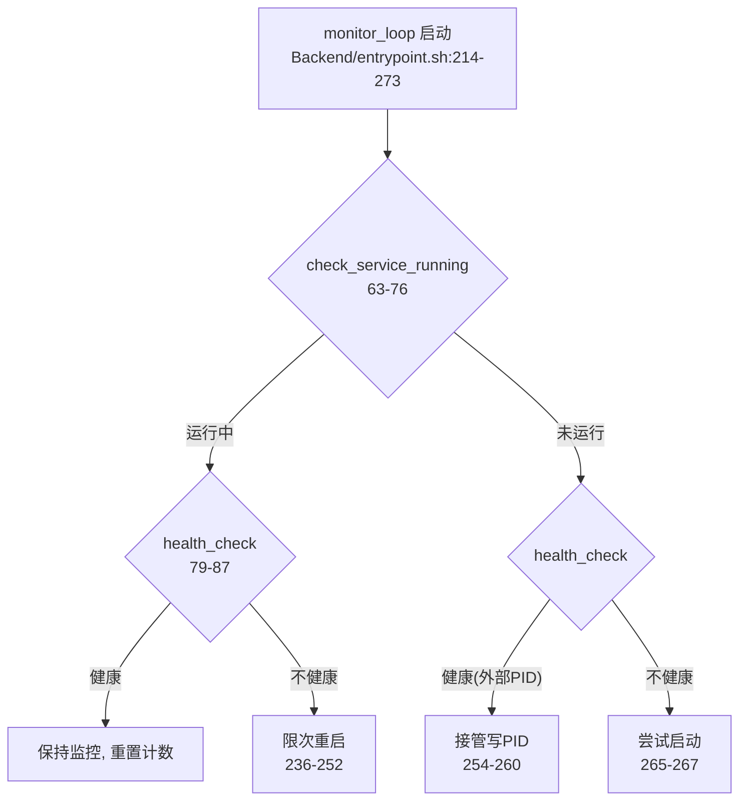
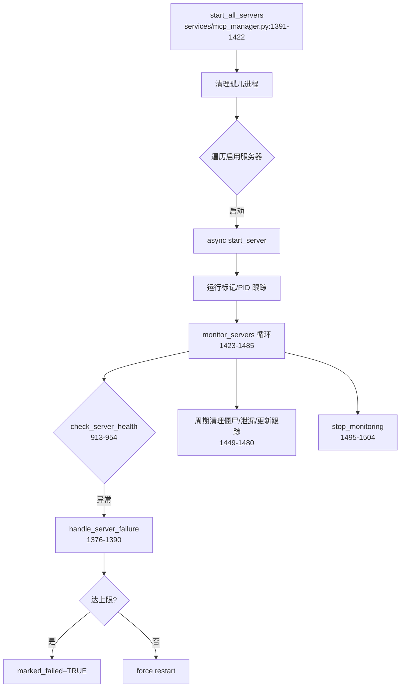
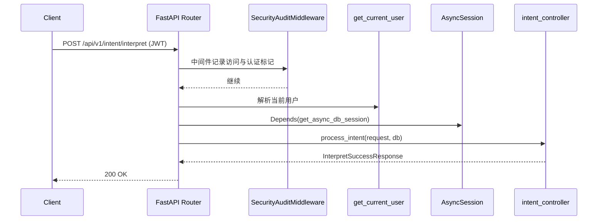
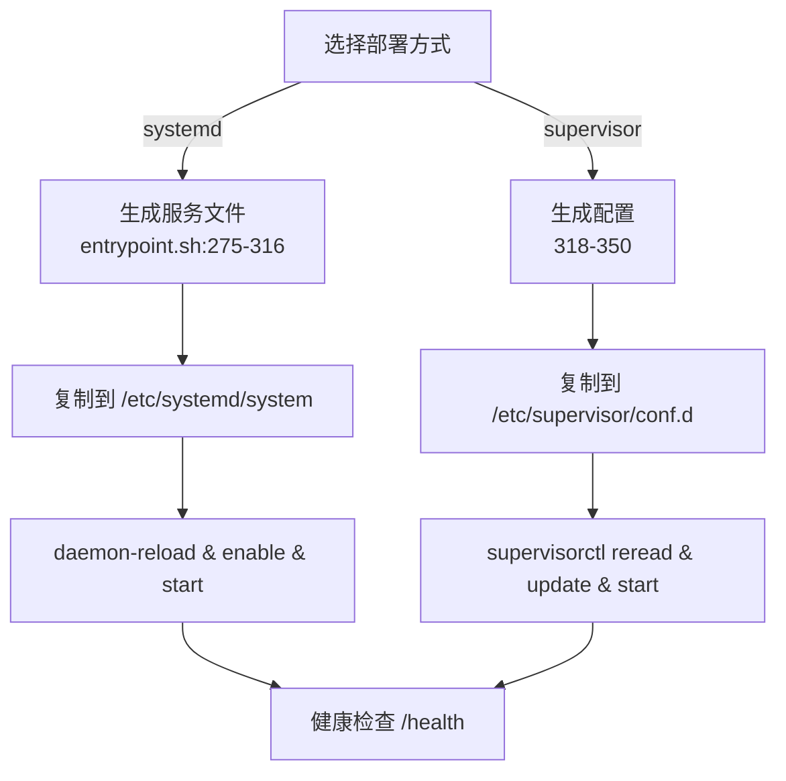

# 启动与运维流程（临时版）

- 你的需求：为后端中所有涉及“流程”的部分生成示意图（SVG），并嵌入到说明中；本次生成的文档与图片仅供临时使用，用完后删除。

## 后端启动总览

```mermaid
flowchart TD
  A[entrypoint.sh start\nBackend/entrypoint.sh:372] --> B{环境与健康检查\n106-181,79-87}
  B -- 健康运行 --> C[幂等接管/跳过\n118-137]
  B -- 未运行/不健康 --> D[激活venv并启动\npython -m uvicorn app.main:app]
  D --> E{/health 200?\nbackend/app/main.py:139-145}
  E -- ok --> F[进入监控\n214-273]
  E -- fail --> G[重启\n206-213]
  D --> I[FastAPI lifespan 启动\nbackend/app/main.py:85-103]
  I --> J[init_db()\nutils/db.py:204-213]
  I --> K[start_all_servers()\nservices/mcp_manager.py:1391-1422]
  I --> L[start_monitoring()\nservices/mcp_manager.py:1486-1494]
```


## 入口脚本监控与自愈




## FastAPI 生命周期与路由装配

```mermaid
flowchart TD
  A1[创建 FastAPI(app)\nbackend/app/main.py:115-122] --> B1[添加 CORS / 安全审计\n125-135]
  B1 --> C1[健康路由与 /docs 重定向\n136-167]
  C1 --> D1[include_router(intent/tools/execute/auth/mcp_status)\n169-176]
  A1 --> E1{lifespan}
  E1 --> F1[启动: init_db()\nutils/db.py:204-213]
  F1 --> G1[启动 MCP 管理器\nmain.py:95-103]
  E1 --> H1[关闭: stop_monitoring\n106-113]
```


## MCP 服务器启动与监控自愈




## 典型请求流程（intent/interpret）




## 部署流程（systemd/supervisor）




> 临时说明：本页与配套 SVG 仅供当前交付使用，验收完成后可统一删除。

## 版本与流程差异（工具选择）

- 远程最近两次更新（origin/backend_test023）
- 执行超时策略改为可配置，默认180秒，读取`settings.EXECUTION_TIMEOUT`，提升在慢网络下的容错（`Backend/backend/app/services/unified_execution_service.py:135-143`）。
- 确认意图识别改为通过`get_openai_client`获取客户端，客户端不可用时返回“未确认”，避免异常中断（`Backend/backend/app/services/unified_execution_service.py:279-329`）。
- 确认执行阶段增加播报内容的提取与忠实改写（`_extract_speakable_text`与`_faithful_tts`），统一输出语音友好文本（`Backend/backend/app/services/unified_execution_service.py:413-420`）。
- 路由文档强化了“确认执行与播报”的契约与超时示例，便于前端正确调用（`Backend/backend/app/routers/intent.py:55-61`）。

- 本地与远程在“工具选择”代码与处理流程的差异
- LLM客户端选择与回退：本地在默认LLM路径新增`get_openai_client`不可用时直接返回`type=direct_response`的回退，远端上一版无此回退，导致本地在未配置或不可用LLM时不再触发工具链（`Backend/backend/app/services/intent_service.py:171-186`）。
- API参数构造：本地将模型、温度、最大tokens改为使用`llm_model/llm_temperature/llm_max_tokens`变量，便于专用意图模型与默认模型的切换（`Backend/backend/app/services/intent_service.py:187-199`）。
- 详尽的LLM输入输出调试日志：本地新增对提示词、可用工具、响应类型与参数的记录，便于定位工具选择行为（`Backend/backend/app/services/intent_service.py:200-223`及后续响应记录）。
- 两段式执行路径一致：工具选择在`/intent/interpret`阶段仅“存待执行工具”，实际调用在`/intent/confirm`阶段执行并汇总（选择与存储：`Backend/backend/app/services/intent_service.py:428-475`；确认后执行：`Backend/backend/app/services/intent_service.py:477-697`；统一确认入口：`Backend/backend/app/services/unified_execution_service.py:336-494`）。

- 影响与排查要点（工具选择相关）
- 若本地`get_openai_client`不可用或未配置`settings.LLM_MODEL/INTENT_LLM_*`，本地将直接走`direct_response`而不调用工具；远端环境若LLM可用则能正常返回`tool_calls`并进入确认执行。
- 数据库中`Tool.request_schema`必须为`{"type":"object", ...}`，否则工具被过滤导致`available_tools`为空，意图阶段不触发工具链（校验逻辑：`Backend/backend/app/services/intent_service.py:26-37,52-87`）。
- 流程上需要在`interpret`后调用`confirm`，否则不会真正执行工具；远端文档已强调该契约（`Backend/backend/app/routers/intent.py:55-61`）。