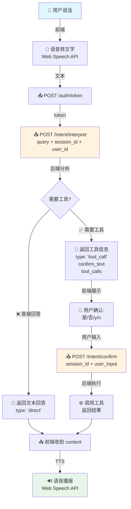

# 前后端对接与API规范

> **快速开始**: API 基础路径 `http://localhost:3000/api/v1` | Swagger 文档 `/docs` | 健康检查 `/health`

## 📋 核心信息

### 服务地址

| 环境 | 地址 | 说明 |
|------|------|------|
| 本地开发 | `http://localhost:3000` | 默认端口 3000 |
| API 文档 | `http://localhost:3000/docs` | Swagger UI |
| 健康检查 | `http://localhost:3000/health` | 返回 `{"status":"ok"}` |

### 认证方式

**JWT Token 认证** - 所有需要认证的接口必须在请求头中携带：
```
Authorization: Bearer {access_token}
```

---

## 🔐 用户认证

### 登录

**⚠️ 重要**：登录接口使用 `form-data` 格式，**不是 JSON**

```javascript
// POST /api/v1/auth/token
const formData = new URLSearchParams();
formData.append('username', 'your_username');
formData.append('password', 'your_password');

const response = await fetch('/api/v1/auth/token', {
  method: 'POST',
  headers: { 'Content-Type': 'application/x-www-form-urlencoded' },
  body: formData
});

const { access_token, role } = await response.json();
// 保存 token: localStorage.setItem('token', access_token);
```

### 使用 Token

```javascript
// 在后续请求中携带 token
fetch('/api/v1/tools', {
  headers: { 'Authorization': `Bearer ${token}` }
});
```

---

## 👥 用户角色与权限

| 角色 | 权限 | 可访问接口 |
|------|------|------------|
| **user** | 基础功能 | `/tools`、`/tools/execute`、`/intent/*` |
| **developer** | 基础 + 开发者控制台 | user 权限 + `/dev/integrations` |
| **admin** | 所有权限 | 全部接口 |

---

## 📡 核心 API 接口

### 认证接口

| 接口 | 方法 | 认证 | 说明 |
|------|------|------|------|
| `/api/v1/auth/token` | POST | ❌ | 用户登录（form-data） |
| `/api/v1/auth/register` | POST | ❌ | 用户注册 |
| `/api/v1/auth/me` | GET | ✅ | 获取当前用户信息 |

### 意图处理

| 接口 | 方法 | 认证 | 说明 |
|------|------|------|------|
| `/api/v1/intent/interpret` | POST | ✅ | 解析用户意图 |
| `/api/v1/intent/confirm` | POST | ✅ | 确认并执行 |

### 工具相关

| 接口 | 方法 | 认证 | 说明 |
|------|------|------|------|
| `/api/v1/tools` | GET | ✅ | 获取工具列表 |
| `/api/v1/tools/execute` | POST | ✅ | 执行工具 |

### 开发者 API 集成 (需要 developer+ 权限)

| 接口 | 方法 | 认证 | 说明 |
|------|------|------|------|
| `/api/v1/dev/integrations` | GET | ✅ | 获取集成列表 |
| `/api/v1/dev/integrations` | POST | ✅ | 创建新集成 |
| `/api/v1/dev/integrations/{id}` | GET | ✅ | 获取集成详情 |
| `/api/v1/dev/integrations/{id}` | PUT | ✅ | 更新集成 |
| `/api/v1/dev/integrations/{id}` | DELETE | ✅ | 删除集成 |
| `/api/v1/dev/integrations/{id}/test` | POST | ✅ | 测试已保存的集成 |
| `/api/v1/dev/integrations/validate-and-test` | POST | ✅ | **【新】**预提交验证与测试<br>**注意**：目前 Dify 集成仅支持“工作流(Workflow)”模式。 |

---

## 💼 典型业务流程

### 场景一：普通用户语音交互

**业务目标**：用户通过语音发布指令，AI 理解并执行，返回结果播报



**关键接口与参数**：

| 步骤 | 接口 | 关键参数 | 返回 |
|------|------|----------|------|
| 1️⃣ 登录 | `POST /auth/token` | `username`, `password` (form-data) | `access_token`, `role` |
| 2️⃣ 意图解析 | `POST /intent/interpret` | `query`, `session_id`, `user_id` | `type`, `tool_calls`, `confirm_text` |
| 3️⃣ 用户确认 | `POST /intent/confirm` | `session_id`, `user_input` | `success`, `content` |

**前后端职责**：
- **前端负责**：语音转文字 ➜ 文本发送 ➜ 用户确认交互 ➜ 语音播报
- **后端负责**：意图识别 ➜ 工具调用 ➜ 结果处理 ➜ TTS 文本优化

---

### 场景二：开发者上传 API 集成

**业务目标**：开发者在提交 API 配置前，进行实时验证和连通性测试，提升开发体验。

```mermaid
graph TB
    subgraph "开发与测试阶段"
        A[👨‍💻 开发者填写表单] -->|前端实时收集| B(📋 表单数据<br/>name, type, endpoint...)
        B -->|数据变化时触发| C[📤 POST /dev/integrations/validate-and-test]
        C -->|后端| D{实时验证}
        D -->|✅ 验证通过| E[✨ 前端UI显示<br/>"验证通过"]
        D -->|❌ 验证失败| F[⚠️ 前端UI显示<br/>具体的错误信息]
    end
    
    subgraph "最终提交阶段"
        G[👨‍💻 点击“提交”按钮] --> H[📤 POST /dev/integrations]
        H -->|后端| I[💾 保存到数据库<br/>status: active]
        I --> J[✅ 返回成功信息]
    end
    
    style A fill:#e1f5ff
    style G fill:#e1f5ff
    style C fill:#fff3e0
    style H fill:#fff3e0
    style E fill:#e8f5e9
    style F fill:#ffebee
```

**关键接口与参数**：

| 步骤 | 接口 | 关键参数 | 说明 |
|------|------|----------|------|
| 1️⃣ **预提交测试** | `POST /dev/integrations/validate-and-test` | `integration_config`, `test_data` | **核心功能**：用于在保存前验证配置和测试连通性。 |
| 2️⃣ 创建集成 | `POST /dev/integrations` | `name`, `type`, `endpoint`... | 当所有测试通过后，最终提交保存。 |
| 3️⃣ 测试已保存的集成 | `POST /dev/integrations/{id}/test` | `test_data: { query }` | 用于测试已经保存在数据库中的工具。 |

**Endpoint 配置示例**：

```javascript
// Dify 平台 (注意：目前仅支持工作流 Workflow 模式)
{ platform: "dify", api_key: "app-xxxxx" }

// Coze 平台  
{ platform: "coze", api_key: "pat-xxxxx", app_config: { bot_id: "123456" } }
```

**前后端职责**：
- **前端负责**：表单收集 ➜ 数据提交 ➜ 结果展示
- **后端负责**：格式验证 ➜ 连通性测试 ➜ 自动生成配置 ➜ 存储管理

---

## ⚠️ 错误处理

| 状态码 | 说明 | 常见原因 | 处理建议 |
|--------|------|----------|----------|
| **401** | 未授权 | Token 无效/过期/未提供 | 清除本地 token，跳转登录页 |
| **403** | 权限不足 | 角色权限不够（user 访问 `/dev/*`） | 提示用户权限不足 |
| **422** | 参数错误 | 请求参数格式错误 | 检查参数格式（如登录是否用了 form-data） |
| **500** | 服务器错误 | 后端异常 | 提示用户稍后重试 |

**错误响应格式**：`{ "detail": "错误描述" }`

---

## 📐 开发规范

### 字段命名

**统一使用 snake_case**：`tool_id`, `session_id`, `user_id`  
❌ **不要使用 camelCase**：`toolId`, `sessionId`, `userId`

---

## 🧪 测试账号

后端预置测试账号（从 `.env` 加载）：

| 角色 | 默认用户名 | 默认密码 |
|------|-----------|---------|
| 普通用户 | `testuser_5090` | `8lpcUY2BOt` |
| 开发者 | `devuser_5090` | `` |
| 管理员 | `adminuser_5090` | `SAKMRtxCjT` |

---

## 📝 变更记录

| 日期 | 变更内容 |
|------|---------|
| 2025-10-13 | `/execute` → `/tools/execute`<br/>`/dev/tools` → `/dev/integrations` |

---

## 🔧 快速调试

**检查服务健康**：`curl http://localhost:3000/health`  
**测试登录**：`curl -X POST http://localhost:3000/api/v1/auth/token -H "Content-Type: application/x-www-form-urlencoded" -d "username=testuser_5090&password=8lpcUY2BOt"`  
**测试 API**：`curl http://localhost:3000/api/v1/tools -H "Authorization: Bearer YOUR_TOKEN"`

---

## 📚 参考资源

- **完整 API 文档**: `http://localhost:3000/docs` (Swagger UI)
- **后端开发文档**: `Backend/docs/后端开发文档.md`
- **产品需求文档**: `Backend/docs/产品开发需求文档PRD.md`

---

> **文档版本**: v0.2.0 (2025-10-13)  
> **维护**: 后端团队  
> **最后更新**: API 路径重构，精简文档结构
